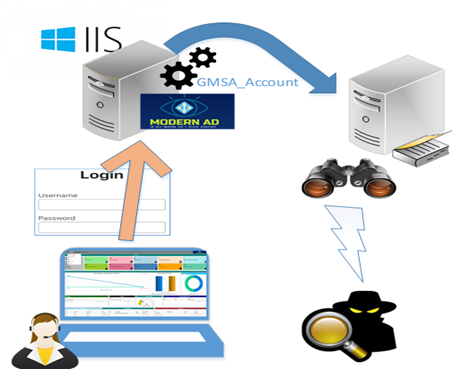

     

# ModernActiveDirectory 
New experience (Safe, Easy, Fast) given an overview of Active Directory environment from a beautiful interactive HTML report


### Get new AD look from one command less than one minute


### What can i do with : 
- [ ] View key indicators
- [ ] Inventory of Active Directory
- [ ] Browse safely Active directory essential objects 
- [ ] Advanced searches in a simple way
- [ ] Support all Active directory languages
- [ ] Faster report building
- [ ] Get daily report
- [ ] No sensitive informations is exposed 
- [ ] Take control over the information displayed
- [x] Work in corporate of any size :tada:

#### Online Installation
> #####  For all users (require admin privilege)
```Powershell
Install-Module -Name ModernActiveDirectory
```
> ##### For Current User (not require admin privilege)
```Powershell
Install-Module -Name ModernActiveDirectory -Scope Currentuser
```
#### Updates
```Powershell
Update-Module -Name ModernActiveDirectory
```
#### Offline Installation
###### Download the Zip file from release and extract it, Copy the three folders on powershell modules path.
> ###### By default for all users :
###### C:\Program Files\WindowsPowerShell\Modules

> ###### For current user (not require admin privilege)
###### Documents\WindowsPowerShell\Modules

###### run after : 
```Powershell
Import-Module -Name ModernActiveDirectory
```
#### Usage
- [ ] Quick run
##### ALL you Need ! One command
```Powershell
Get-ADModernReport
```
- [ ]  By default the number of objects listed is limited to 300 for testing / you can bypass by using -illimitedsearch
- [ ]  The report is saved on %appdata%\Temp. To change the directory use the parameters -Savepatch

```Powershell
Get-ADModernReport -illimitedsearch -SavePath C:\MyFolder
```
#### Help
- List Examples
```Powershell
Get-Help Get-ADModernReport -Examples
```
- More detail
```Powershell
Get-Help Get-ADModernReport -Detailed
```
### Dependencies
- [x] RSAT if run externally from Windows 10 machine
- [ ] Powershell 5.1 or more
- [ ] PSWriteHTML Module (Automatically installed)
### Variables
| parameters  | Description |
| ------------- | ------------- |
| CompanyLogo   | Logo that will be in the upper left corner of the report  |
| IllimitedSearch | Search in all objects without number limits |
| OUlevelSearch | Search level in OUs (Base/Onelevel/Subtree) |
| SavePath      | where the report will be saved (Example : C:\report ) |
| HtmlOnePage | Generates a report in one page, (recommended for small companies) |
| RightLogo     | The logo that will be in the upper right corner of the report |
| ReportTitle   | the title of the report |
| Days          | Defines the days for "Search for users who have not logged in for X days" |
| UserCreatedDays | Defines the days to "Get users who have been created in X days or less" |
| DayUntilPWExpireINT | Sets the days to "Get users whose passwords expire in less than X days" |
| Maxsearcher | Maximum number of Computer/User objects to search |
| Showadmin | Display the administrators in the result |

Two specific values are added to the “Days Until Password Expired” column:

* -999 : means that the user has never logged in.
* -998 : means that the user will have to change without CDM at the next connection.


## Credits
### MVP Members 
- [Przemyslaw Klys](https://www.linkedin.com/in/pklys/) author of PSWriteHTML - without him this wouldn't be possible [Github](https://github.com/EvotecIT/PSWriteHTML)
- [Brad Wyatt](https://www.thelazyadministrator.com/) author of inspired project [Github](https://github.com/bwya77)
- [Thirrey DEMAN-BARCELO](https://www.experts-exchange.com/members/DEMAN-BARCELOMVP-Thierry.html)
- [Florian Burnel](https://www.it-connect.fr/author/florian/)
### Other members
Matthiew Souin, Hatira Mahmoud, Sarouti Zouhair
### Thanks 


* French article : [Link](https://www.it-connect.fr/une-vue-densemble-de-votre-annuaire-en-un-clin-doeil-avec-modern-active-directory/).
* English article : [Link Brad](https://www.thelazyadministrator.com/2023/03/19/modern-active-directory-an-update-to-pshtml-ad-report/)
* Doc : [Link_Thirrey_Expertexchange](https://www.experts-exchange.com/articles/37935/Modern-Active-Directory-part-1-2.html)
                

## Security

#### We can improve security by using the following design and tracking who has sent an AD request, because only authotified users can show allowed informations.


